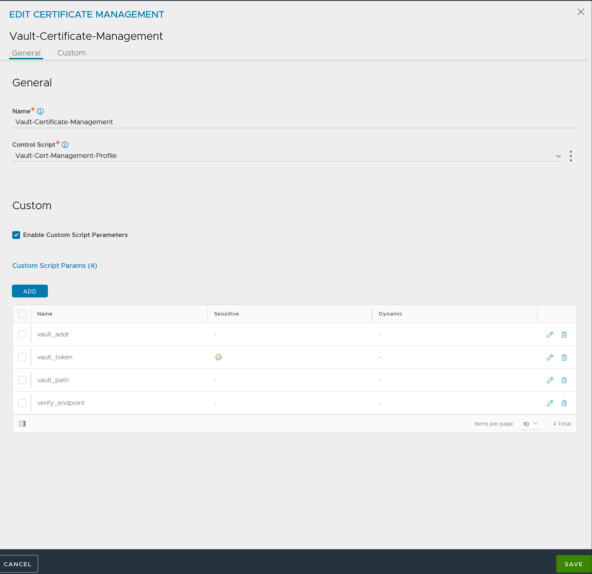

# Certificate management profile scripts
A collection of scripts to use in conjunction with the VMware Avi Load Balancer CSR automation feature.

See [this doc](https://docs.vmware.com/en/VMware-Avi-Load-Balancer/30.2/Configuration-Guide/GUID-22E2F1A6-6A58-4231-A740-01D1F8726AD2.html) for more information.

## vault_cert_management.py

This is a Certificate Management Profile script for Hashicorp Vault acting as a Certificate Authority (PKI Secrets Engine).

The Certificate Management Profile should be configured with the following parameters:

*vault_addr*:\
**REQUIRED**\
Base URL for the Vault API.

Example: https://vault_server.contoso.com:8200

*vault_path*:\
**REQUIRED**\
API path for the **sign** API endpoint for the specific PKI secrets engine and role.

Example: /v1/pki_int/sign/contoso-com-role

*vault_token*:\
**REQUIRED**\
An API token with sufficient access to call the signing API.

Note: It is strongly recommended to mark this parameter as "sensitive".

The following optional parameters may be specified:

*vault_namespace*:\
**OPTIONAL**\The Vault namespace under which to make the signing API call. If not specified, the default namespace will be used.

*verify_endpoint*:\
**OPTIONAL**\
The CA certificate chain (in PEM format) that should be used to verify trust for the SSL connection to the Vault API endpoint. If this parameter is not provided, SSL verification for the API calls to Vault will be disabled.

*api_timeout*:\
**OPTIONAL**\
The timeout that should be applied to the call to the Vault API endpoint. A default timeout of **20 seconds** will be used if this parameter is not specified.

## LetsEncrypt certificate management profile scripts

# letsencrypt_mgmt_profile.py
A cert management profile script that will utilize an HTTP listener for the LE challenges

See [this document](https://docs.vmware.com/en/VMware-Avi-Load-Balancer/30.2/Configuration-Guide/GUID-E642EC54-3DA1-460D-BBF9-AB52829B3CCB.html) for more information

# letsencrypt_mgmt_profile_with_route53_dns.py
A cert management profile script that will publish DNS records to AWS Route53 DNS for LE challenges

| Parameter | Description | Default Value |
| --------- | ----------- | ------------- |
| user | Avi user name | None |
|password | Password of the above user | None |
|tenant | Avi tenant name | "admin" |
| dryrun | True/False. If True Let's Encrypt's staging server will be used. Main purpose is not to get ratelimited by LetsEncrypt during testing. | False |
| contact | E-mail address sent to letsencrypt for account creation.  (set this only once until updated, otherwise an update request will be sent every time.) | None |
| directory_url | Change ACME server, e.g. for using in-house ACME server. | "Let's Encrypt Production" |
| overwrite_vs | Specify name or UUID of VirtualServer to be used for validation and httpPolicySet. Useful for scenarios where VS cannot be identified by FQDN/hostname, e.g. when it's only listening on IP. Important Note: Export+Import of Avi configuration CAUSES the UUID to change! | Not set |
| letsencrypt_key | Lets Encrypt Account Key | None |
| aws_access_key_id | AWS Access key with permissions to modify Route 53 records | None
| aws_secret_access_key | AWS Secret key | None
| hosted_zone_id | ID for zone where DNS challenges should be published | None

# letsencrypt_mgmt_profile_infoblox_dns.py
A cert management profile script that will publish DNS records to Infoblox for LE challenges.

See [this document](https://docs.vmware.com/en/VMware-Avi-Load-Balancer/30.2/Configuration-Guide/GUID-E642EC54-3DA1-460D-BBF9-AB52829B3CCB.html#configuring-lets-encrypt-using-infoblox-dns-for-avi-load-balancer-8) for further information 

## Sectigo certificate management profile script
